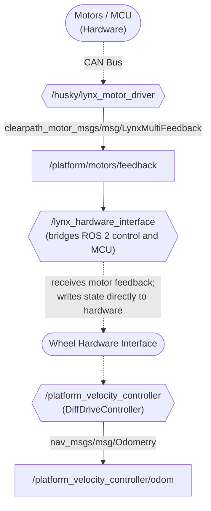

# Feedback from Hardware

Now that we understand [how a command gets down to the hardware](./Clearpath_Platform_Command.md),
it's important that we get feedback from the hardware to ensure our command took effect!
For Togo, feedback about the joint states of the wheels affects:

- The `/joint_states` from the `/joint_state_publisher` node
- The `/platform_velocity_controller/odom` from the `/platform_velocity_controller` node

since both of these publish messages based on the state interfaces of the wheels.
Feedback from the hardware gets passed through the same nodes as the commands, just in reverse.

> [!NOTE] Prerequisites
> Please refer to [tracing a command down to hardware](./Clearpath_Platform_Command.md) as a prerequisite to this page.
> This page goes into less detail about ROS 2 control and what each relevant node does,
> instead focusing on the flow of information between nodes.

## Summary Flowchart

## Lynx Motor Driver

The `/husky/lynx_motor_driver`
[reads state feedback from the motor drivers](https://github.com/clearpathrobotics/clearpath_robot/blob/jazzy/clearpath_motor_drivers/lynx_motor_driver/src/lynx_motor_node.cpp#L225)
and
[publishes feedback messages](https://github.com/clearpathrobotics/clearpath_robot/blob/jazzy/clearpath_motor_drivers/lynx_motor_driver/src/lynx_motor_node.cpp#L257)
of type `clearpath_motor_msgs/msg/LynxMultiFeedback` to topic `/platform/motors/feedback`.

## Lynx Hardware Interface

The `/lynx_hardware_interface`
[subscribes to the feedback messages](https://github.com/clearpathrobotics/clearpath_robot/blob/jazzy/clearpath_hardware_interfaces/src/lynx/hardware_interface.cpp#L61)
from topic `/platform/motors/feedback`,
processes the [state interfaces (wheel position and velocity)](https://github.com/clearpathrobotics/clearpath_robot/blob/jazzy/clearpath_hardware_interfaces/src/lynx/hardware.cpp#L105),
and [writes the state interfaces](https://github.com/clearpathrobotics/clearpath_robot/blob/jazzy/clearpath_hardware_interfaces/src/lynx/hardware.cpp#L247)
to the ROS 2 hardware interface.

## Platform Velocity Controller

The `/platform_velocity_controller`
[reads from the wheel state interfaces](https://github.com/ros-controls/ros2_controllers/blob/jazzy/diff_drive_controller/src/diff_drive_controller.cpp#L184)
to get feedback.
The controller uses the wheel state feedback to [update its odometry computations](https://github.com/ros-controls/ros2_controllers/blob/jazzy/diff_drive_controller/src/diff_drive_controller.cpp#L218),
which allows the odometry to track the robot's pose in the world as it navigates!
