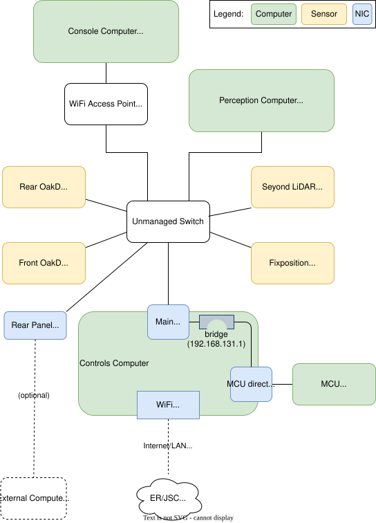

# Togo Network Setup

Togo is designed to support a wide array of network setups. This document is about the settings we've been using in the DRL that will likely transfer with a few changes to B16.

Per the standard Clearpath configuration, robot network addresses look like 192.168.131.x. The basic network setup for Togo is as follows:



There are multiple reasonable network configuration options we might want to support for Togo.

- Isolated. This is the initial state of the robot and will also apply when the robot is moved to B16, or when the robot is operated outside beyond the range of NASA WiFi. In this configuration, the console computer can attach to the robot via the access point, but the controls computer does not have NASA LAN access either via WiFi or via the Rear Panel Ethernet port.
- Wireless NASA LAN. This is the expected configuration in the lab. In B9, the robot will be connected to the ER DRL WiFi. In B16, the robot will be connected to the JSC WiFi.
- Wired NASA LAN. This configuration involes connecting a NASA LAN through the Rear Panel Ethernet port. It would most likely be used in the lab if NASA WiFi connectivity is not working.
- Wired Client. An Ethernet sensor or external computer may be connected via the Rear Panel Ethernet port. Per the vendor documentation, this is the intended use of the rear port. In this mode, the client should be configured with a static IP on the robot network (192.168.131.x).

The Husky wired network configuration is managed with netplan files rather than using NetworkManager directly. At the moment we're using NetworkManager for the WiFi setup, but this could also be switch to networkd. In both cases, the configuration is contained in yaml configuration files under /etc/netplan. Viewing or editing these files requires sudo. If a change needs to be made to the configuration, the safest course of action is to run

```
sudo netplan --debug generate    <-- this will show if the configuration has any errors

sudo netplan try                 <-- this will attempt to implement the changes and roll back if there are errors
```

The stock Clearpath setup gets us most of the way to where we need to be. This creates a network bridge for the two wired interfaces (to the MCU and to the switch) allowing the controls computer to be addressed by a single address regardless of origin. The robot sensors talk with the controls computer and each other through the switch.

The external console computer accesses the controls computer via switch through a WiFi access point. The access point can provide a DHCP address to the console, but we recommend that the console also be statically configured because if the rear Ethernet is connected to a DHCP provider (such as a NASA LAN), the console may receive a NASA LAN address which will not work for talking to the robot.

Our default setup defines the onboard WiFi as the connection point to the NASA LAN rather than using the rear port. This is because 
- using the rear port for LAN access requires assigning a LAN IP address to the main NIC on the controls computer, which means it is no longer on the robot subnet
- the WiFi connection is available with the rear panel closed, and having the panel closed is required to drive the robot
- the WiFi connection is more versatile for testing and does not require running a line to the robot

Assuming we have a NASA LAN connection over WiFi, we want external packets (e.g. git pulls, security updates) to route over the WiFi. To make this work, we add to the bridge defintion

```
      dhcp4-overrides:
        use-routes: false
```

This prevents Linux from adding the bridge as a default route, which per Linux rules would take precedence over the WiFi connection because it is faster. This does not impact packets whose source and destination are on the robot network.

The rear panel Ethernet port can be be used to add a sensor or another computer or as a backup NASA LAN connection. Note, however, that having the panel open triggers an E-stop that prevents the robot from being driven. It may be possible to have a very thin Ethernet coming out of the panel without tripping the close sensor [TBD]. 

When using the rear port to attach to the NASA LAN, the main NIC on the controls computer will receive a DHCP address from the LAN. This is a necessary part of gaining LAN access, however it means that controls computer will now be on a different subnet from the sensors and other computers attached to the switch. This is OK if the goal is to pull in software on the LAN or to allow remote access to perform maintenance. For this use case, we *do* want offboard traffic to travel over the bridge, so we need to set the ```use-routes``` parameter to true and restart the network using the ```netplan``` commands mentioned earlier.

Current Linux netplan setup
```
network:
  version: 2
  renderer: networkd
  ethernets:
    bridge_enp:
      match:
        name: "enp*"
      dhcp4: false
      dhcp6: false
    bridge_enx:
      match:
        name: "enx*"
      dhcp4: false
      dhcp6: false
    bridge_eth:
      match:
        name: "eth*"
      dhcp4: false
      dhcp6: false

  bridges:
    br0:
      addresses:
      - "192.168.131.1/24"
      dhcp4: true
      # Don't add a default route through the bridge. This means only traffic
      # on 192.168.131.x is routed across the bridge which is usually what we want. 
      # If you need to attach the robot to a LAN via the rear Ethernet port, 
      # comment this out then run "netplan generate; netplan apply".
      dhcp4-overrides:
        use-routes: false
      dhcp6: false
      interfaces:
      - bridge_eth
      - bridge_enx
      - bridge_enp

  wifis:
    wlp2s0:
      # This allows the WiFi to exist without causing issues if the
      # AP is not available.
      optional: true

      access-points:
        ER_DRL:
          password: "XXX INSERT PASSWORD HERE XXX"
      dhcp4: true
      dhcp4-overrides:
        send-hostname: true

```

# Togo Firewall
The default NASA IT setup installs a firewall on the robot using a program called ufw. By default, it allows all outbound traffic, but only ssh in, which is obviously no good for a robot that will be receiving ROS traffic and sensor data. The firewall rules can even block some traffic moving across the bridge, or prevent the WiFi connection from talking to the access point.

The current setup allows the following:
- ssh (port 22/tcp) -- required to access the controls computer
- DDS multicast traffic on 239.255.0.1/udp -- required for ROS topics
- UDP unicast port traffic -- required for ROS topics
- UDP port 8010 (custom use) -- required by vendor sensor
- all traffic from one bridge interface to another* -- shared internal robot traffic
- SSDP (multicast on 239.255.255.250/udp) -- network services adverisment
- UDP port 3702 (WS-Discovery) -- network services locator
- IGMP* -- multicast management
- AllHosts service (multicast on 224.0.0.1) -- ensures we receive multicast
- mDNS (multicast on 224.0.0.251) -- allows hosts to discover each other

Items marked with an asterisk are allowed using special iptables rules implemented in the systemd service ufw-extra-rules.service

The following packets have been observed as blocked but are deemed OK to block
- traffic from console to Canonical hosts -- going through the robot is not the path for these

All of these have been verified as being blocked by the default ufw setup.

Ufw logs what it blocks to /var/log/syslog with the string 'UFW BLOCK'. However, looking at this file does require sudo.
