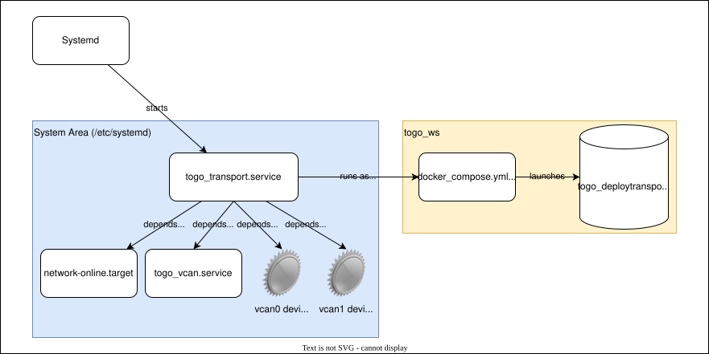

# Transport Mode

## Description

On startup, it is convenient if the robot boots immediately to a mode that supports driving without requiring a console computer. We call this "Transport Mode" because it is suitable for moving the robot, but does not necessarily have full robot functionality.



On Togo, transport mode automates the normal docker startup procedure with some minor adaptations. As is typical in modern Linux, the automation is enacted through a systemd service: `/etc/systemd/system/togo-transport.service`. The service declares what dependencies need to be in place before starting transport mode, and what command the system will execute once those dependencies are in place. In additon to living on the robot, the service defintion is also available in the togo_system_config repository.

In terms of dependencies, transport mode requires communication to the hardware including low-level communication with the drive motors and battery, so the virtual CAN devices that facilitate this communication must be available. Since the virtual CAN devices talk over Ethernet, this implies that the network must also be up and running. 

As when running interatively, we want the transport mode docker to run as eguser and not as root. This ensures that outputs from the session such as logs have the right ownership and (more importantly) allows eguser to stop transport mode later on if needed.

While systemd has no trouble running a docker as eguser, for security reasons systemd services are started in a more limited environment than would be the case when starting from an interactive bash shell. In particular, it is necessary to explicitly provide values for key environment variables used by the docker:

- RMW_IMPLEMENTATION -- indicating the choice of ROS middleware
- FASTRTPS_DEFAULT_PROFILES_FILE -- pointing to our custom DDS profile
- ROS_DOMAIN_ID -- indicating which DDS domain is to be used by the robot

With these in place, we use `docker compose` to run the transport service from the togo workspace. This service is based on the hw-dev service used for development on the robot except that instead of running a sleep command it launches togo_deploy's transport.launch.py launch file. The transport launch file then runs the communication and control start up commands that would be run by the user in an interactive session.

## Stopping Transport Mode

Since starting in transport mode is the default, there must be a way to stop it in order to return to the normal interactive setup. Since eguser does not have sudo, we stop the transport mode container directly using docker compose rather then using systemd. This is not particularly complicated, but we have added a convenience `stop_transport_mode` alias in the eguser's .bashrc to make it as simple as possible. This alias may be run from any directory and is defined as:
```
alias stop_transport_mode='docker compose -f /home/eguser/togo_ws/docker-compose.yml kill transport'
```


## Running Transport Mode Manually

It is sometimes useful to try out starting transport mode manually. This could make sense, for example, to validate that transport mode still works after making changes. Assuming the transport mode systemd service has not changed, this is a matter of stopping the service using `stop_transport_mode` then using the docker compose file to start it from the command line. In this case, it might be best not to use the "-d" flag to docker compose so that the output is visible in the terminal.

```
cd $HOME/togo_ws
docker compose up transport --force-recreate
```

## Troubleshooting and Limitations

If transport mode is not working, there are a couple of things to try. First, systemd provides a status for every service including whether the service is running, and the last few lines of output. This is quick to use, does not require sudo and can be very useful if transport mode is breaking immediately or is on the systemd side.

```
systemctl status togo-transport.service
```

For more detailed output, it is recommended to run the transport service manually (see above).

## Bugs and Limitations

1. Because transport mode is based on the hw-dev docker compose service, if hw-dev is broken then transport mode will likely also be broken. The tradeoff is whether transport mode should use the latest version of what is running on the robot, or run a stable version. We can change the approach by specifying a different starting image for the transport service in the `togo_ws/docker-compose.yml` file.
2. The transport mode systemd service must set the ROS_DOMAIN_ID environment variable. It is easy to forget to change the service definition if ROS_DOMAIN_ID is updated elsewhere in the system. This will not usually prevent transport mode from starting but may result in missing nodes/topics if the value of ROS_DOMAIN_ID in the service disagrees with the command-line value.
3. The path to the workspace is hard-coded in the system service. Bear this in mind if you need to create multiple workspaces to support multiple developers with conflicting tasks, or when porting to a different OS version. Running the `systemctl status` command above provides the exact command used by the service if there is any doubt.

