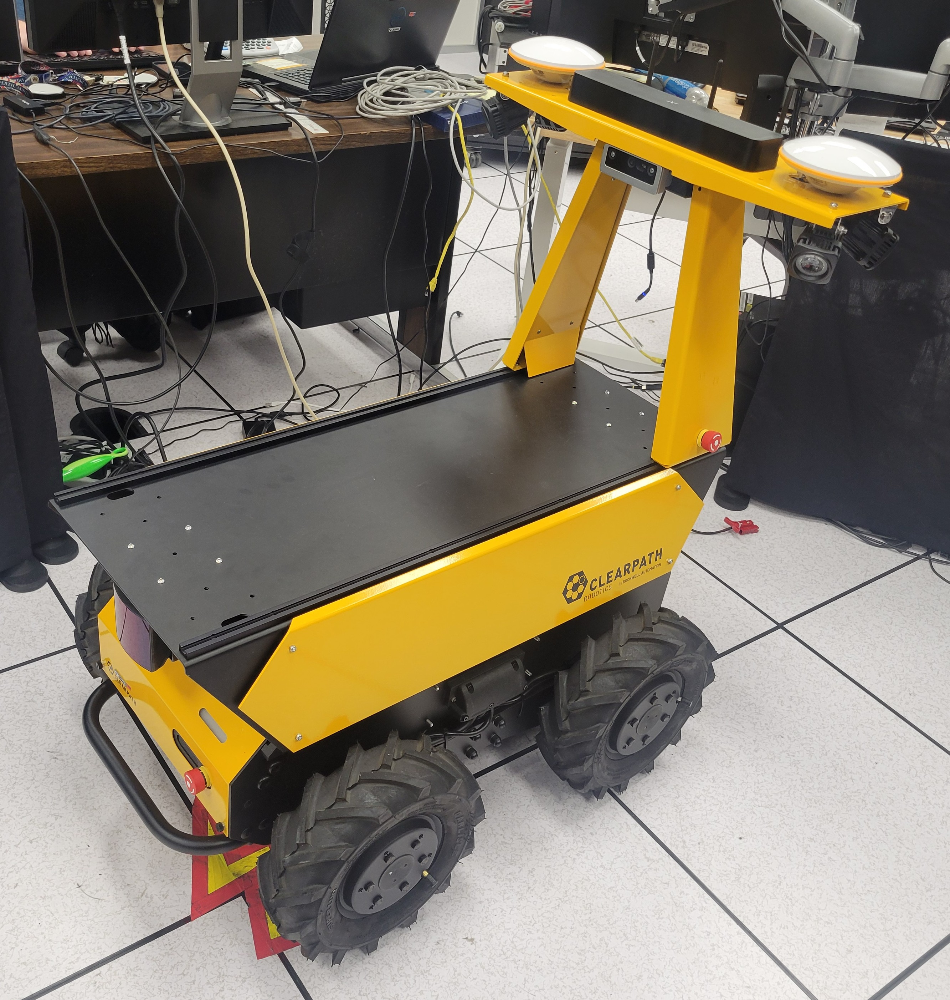
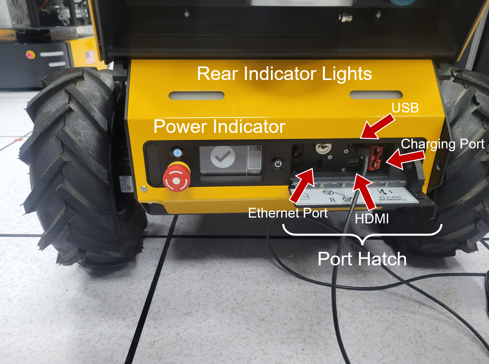
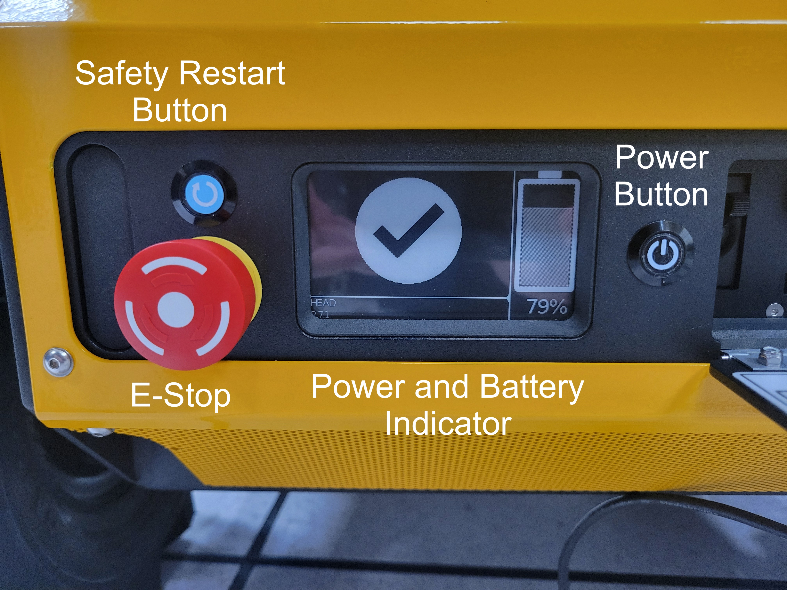
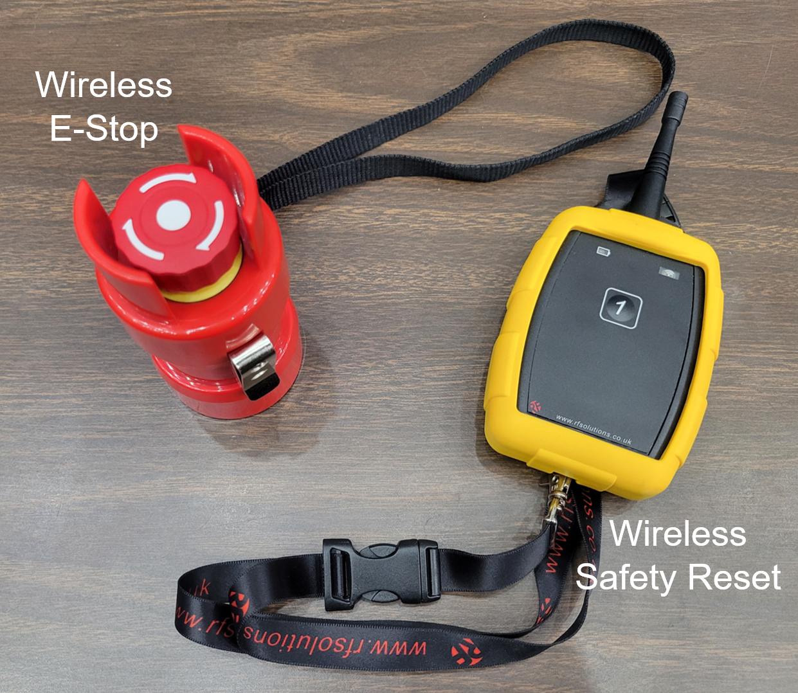
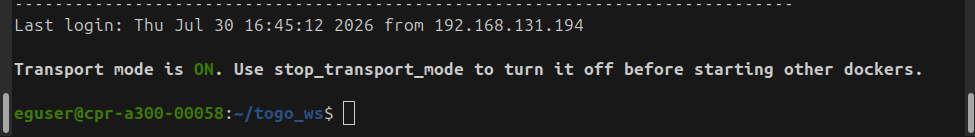
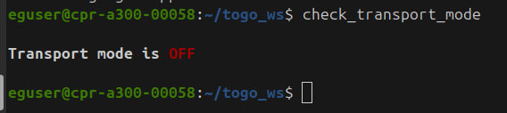
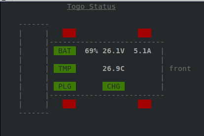
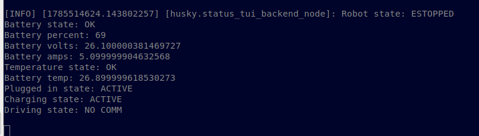
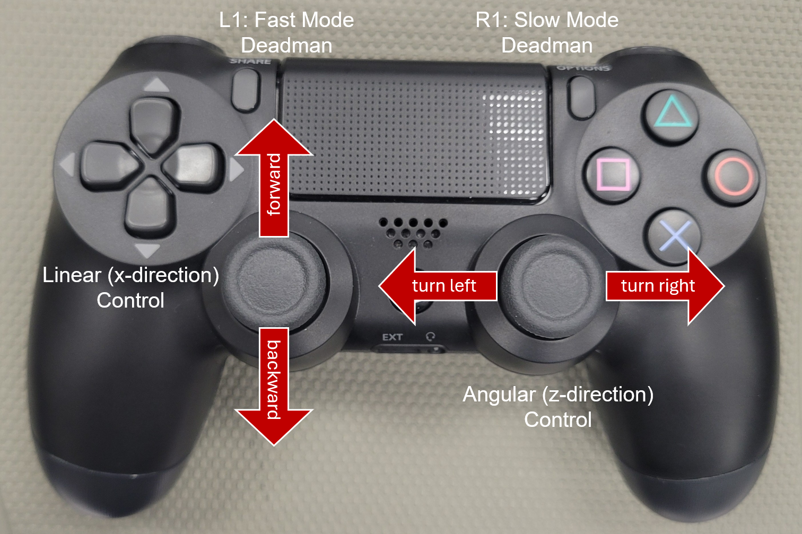
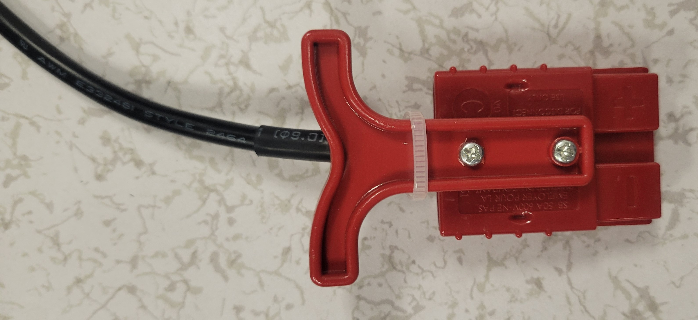

# Togo

Instructions for running Togo, the Clearpath A300 Husky Autonomous Mobile Platform (AMP).
Please refer to the [Husky User Manual](https://docs.clearpathrobotics.com/docs_robots/outdoor_robots/husky/a300/user_manual_husky/) for more in-depth information.

The Togo platform includes several systemd services that run whenever the robot is booted up.
These services take the place of the default Clearpath configuration that comes on the robot out-of-the-box.
For more information about enabling/disabling Clearpath's baseline configuration, please refer to our [Clearpath systemd docs](./docs/CLEARPATH_SYSTEMD_SERVICES.md).



## Table of Contents

- [Togo](#togo)
  - [Table of Contents](#table-of-contents)
  - [Hardware Run Instructions](#hardware-run-instructions)
    - [From Power Off to Transport Mode](#from-power-off-to-transport-mode)
    - [Switching to Interactive Mode](#switching-to-interactive-mode)
    - [Joystick Control](#joystick-control)
    - [Launch Sensors and Visualization](#launch-sensors-and-visualization)
    - [E-stop Recovery](#e-stop-recovery)
    - [Shutting Down the Robot](#shutting-down-the-robot)
  - [Gazebo Run Instructions](#gazebo-run-instructions)
    - [Nav2 Integration](#nav2-integration)

## Hardware Run Instructions

See our [hardware overview docs](./docs/HARDWARE_OVERVIEW.md) for more information about Togo's hardware components.

Hardware instructions are taken directly from the [Husky Quick Start](https://docs.clearpathrobotics.com/docs_robots/outdoor_robots/husky/a300/user_manual_husky/#quick-start) guide.
However, we provide additional details specific to Togo's setup.

For Togo, we recognize two distinct operational use cases. The first addresses the desire to start the robot and drive it somewhere with the joystick controller without needing network setup or another computer in the mix. We call this "Transport Mode." The second addresses the need to interact with the robot -- to look at sensor values, or collect rosbags, or run custom software packages. These tasks are by their nature interactive and require another computer to act as an interface to the robot, so we'll call this use case "Interactive Mode," and we'll label this second computer the "robot console." 

By default, the robot boots into Transport Mode, so that the basic platform comm nodes, control nodes, and joystick control nodes are brought up in the Togo docker container as part of startup. For more in-depth information about what transport mode does, please refer to [transport mode docs](../../references/documentation/Transport_Mode.md). The robot may be transitioned to Interactive Mode by connecting the console and sending commands over ssh to start the stock ROS launch files for control and visualization. Developing custom code on the robot throws up a different set of considerations. Please refer to our [development docs](./docs/TOGO_DEVELOPMENT.md) for information on this.

### From Power Off to Transport Mode

1. Verify the robot is in a ready state.
   1. Unplug the charger and any other cables attached at the port hatch.
   2. Close the port hatch door.

   > Note: The robot treats the hatch door as an EStop and will not enable motion if this hatch is open.

    

2. Press and hold the Power Button for one second and then release it.
  The 4 status lights will be solid red while the robot's computer boots up.

    

3. Wait one minute for the robot's computer and MCU to boot up. 
4. Ensure all e-stops (two on robot, front and rear, and one wireless) are unplunged. Don't forget about the port hatch needing to be closed.
  If one of the e-stops is pressed, all 4 status lights will be blinking red in unison.
  Once the e-stops are released, the status lights will alternate blinking red left/right, indicating the safety restart button needs to be pressed.

    

5. Press and release the Safety Restart button, either the one on the robot (see picture) or the wireless reset button. When the robot is ready to go, the front lights will be solid white and the rear lights (by the mast) should be solid red. If you plan to move to Interactive Mode, skip to the next section.
6. Power on the PS4 controller and wait for it to connect to the robot. You're now ready to drive. See [joystick control](#joystick-control) below for more information on driving Togo.

### Switching to Interactive Mode

These instructions assume the robot has been powered on and is ready to move in Transport Mode.
1. Log in to the console computer and check that it has connected to the robot "cpr-..." WiFi network (for example by opening a terminal and using `ping robot`). The robot WiFi typically takes longer to come up than the rest of the robot, so give it an extra minute beyond the usual robot boot time.
2. Ssh into the robot from the console computer:
    ```bash
    ssh robot
    ```

Note that when you SSH into the robot, the transport mode status will be reported (transport mode defaults to on):



3. To stop transport mode, run the following alias on Togo (on the host side, *not* in a docker container):

```bash
stop_transport_mode
```

This kills the docker container running transport mode. The basic platform comm and control nodes are now no longer running.

We can confirm transport mode is off using the command `check_transport_mode`:



4. Start the hardware docker container and launch a terminator inside it. Note that transport mode must be stopped before starting this container or the robot will have two end up with two different control sources.

```bash
# bring up the container; this will automatically start the micro-ROS agent docker container as well
docker compose up hw-dev -d --force-recreate

# connect to the running container
docker compose exec hw-dev terminator
```

> [!NOTE]
> Unless otherwise noted, all remaining hardware instructions should be run in the terminator window or in a shell inside the container.

5. Start Husky hardware communications:

    ```bash
    ros2 launch togo_deploy husky_comm.launch.py
    ```

6. To bring up Togo's controllers and teleop control (enabling control through the PS4 controller),
we include a convenient launch file for Togo's hardware operation mode.

    ```bash
    ros2 launch togo_deploy control_hardware.launch.py
    ```

7. Start Togo's system status monitor:

    ```bash
    ros2 run togo_status_handler togo_status_terminal --ros-args -r __ns:=/husky
    ```

    The status monitor displays information about Togo's robot state (e-stopped, needs reset, and driving based on lighting), battery information, battery temperature, plugged in and charging states, and driving state.
    Please see [status monitor docs](./docs/SYSTEM_STATUS_MONITOR.md) for more information about the data provided by the status monitor.
    Below is an example status monitor showing the robot is e-stopped, nominal battery charge and temperature, and the robot is plugged in and charging.

    

    The status monitor can also be started without a display with flag `-n` for `--no-display`, in which case status information will be printed out:

    ```bash
    ros2 run togo_status_handler togo_status_terminal -n --ros-args -r __ns:=/husky
    ```

    

8. At this point, Togo is ready to drive! Connect the PS4 controller and see [joystick control](#joystick-control) below for more information on driving Togo.

9. To launch your own application nodes, you may need to [launch the sensors](#launch-sensors) as well.
  Please see [development on Togo docs](./docs/TOGO_DEVELOPMENT.md) for best practices for your own development on Togo!

### Joystick Control

At this point after following the instructions above (for either transport or interactive mode), joystick control should be active on the robot.
To use the PS4 controller to run the robot:

1. Ensure the controller is charged.
2. Press the middle button to power the controller on and connect it to the robot.
3. L1 is the fast mode deadman switch, R1 is the slow mode deadman switch.
 Press and hold either deadman for whichever drive mode is desired.
 By default, fast mode velocity and acceleration limits are twice as fast as the slow mode limits.
4. Use the left joystick to send linear (x-direction) commands to Togo. Use the right joystick to send angular (z-direction) commands to Togo.



### Launch Sensors and Visualization

Start Togo's sensors (and related nodes, including the IMU filter and localization) and view the robot and sensor data in RViz:

```bash
ros2 launch togo_deploy togo_sensors.launch.py
```

For more information about the sensors available on Togo, please see [hardware overview of sensors](./docs/HARDWARE_OVERVIEW.md#sensors).

### E-stop Recovery
If the E-stop has been pressed during operations, recovery is straightforward.
1. Unplunge the E-stop. The robot will return to alternative left/right blinking red lights.
2. Press the reset button.

### Shutting Down the Robot

When you're done with Togo for the day:

1. Stop any nodes you started.
2. Exit the docker container.
3. Turn off the robot by pressing the power button.
4. Plug the robot in to charge.
    
5. Say "Good boy, Togo!" and give him a lil pat of appreciation.

## Gazebo Run Instructions

To bring up Togo in Gazebo, run:

```bash
ros2 launch togo_gz sim_gz.launch.py
```

This launch file will launch the controls appropriately from the `togo_deploy` package using the Gazebo URDF in the `togo_gz` package.
The Gazebo URDF instantiates the Togo macro in `togo_description` and adds the appropriate `ros2_control` plugins for Gazebo.
This launch file will also automatically launch RViz to view the simulated robot and sensor information.

Once Gazebo is running, you can publish velocity commands from the command line:

```bash
ros2 topic pub --once /platform_velocity_controller/cmd_vel geometry_msgs/msg/TwistStamped 'header:
  stamp: now
  frame_id: ''
twist:
  linear:
    x: 0.0
    y: 0.0
    z: 0.0
  angular:
    x: 0.0
    y: 0.0
    z: 0.5
'
```

Publish a zero command to stop the robot:

```bash
ros2 topic pub --once /platform_velocity_controller/cmd_vel geometry_msgs/msg/TwistStamped 'header:
  stamp: now
  frame_id: ''
twist:
  linear:
    x: 0.0
    y: 0.0
    z: 0.0
  angular:
    x: 0.0
    y: 0.0
    z: 0.0
'
```

If you have any problems running Gazebo, please refer to our [Gazebo troubleshooting docs](./docs/GAZEBO_TROUBLESHOOTING.md).

### Nav2 Integration

A nav2 configuration is provided, along with several sample worlds and deployment mechanisms.
For more information refer to the [README](./togo_nav2/README.md).
