# Status Monitor

An overview of the information the status monitor displays.

The status monitor updates every ~1 second.
There may be a slight delay before status information is displayed.

If comms drop out or information is missing, the monitor will show the missing information greyed out and/or with NaN values.
An example of no data for all status information is shown below:

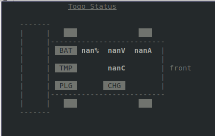

## Robot State

Robot state (e-stopped, needs reset, or driving) is indicated by the lights in the 4 corners of the robot.

When the robot is e-stopped, all 4 lights will blink red:

When the robot needs a reset, the lights will blink red, alternating left/right:

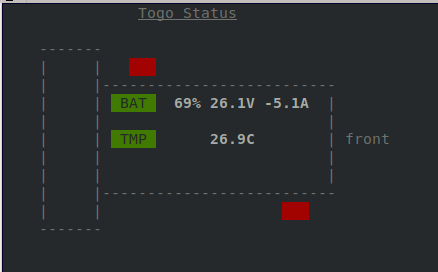

When the robot is ready, the back lights will be red and front lights will be white:

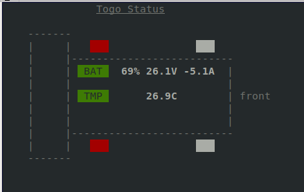

## Battery Charge

Battery charge states are color coded: full is blue, nominal is green, low is yellow, and faulted is red.
Note that when the battery is full (higher than 90% charge), the [Clearpath docs warn](https://docs.clearpathrobotics.com/docs_robots/outdoor_robots/husky/a300/user_manual_husky/#regenerative-current-limits) against operating on steep inclines.

When the battery charge is full (higher than 90%), the battery indicator will be blue:

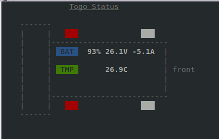

When the battery charge is nominal (between 20% and 90%), the battery indicator will be green:

When the battery charge is low (20% and below), the battery indicator will be yellow:

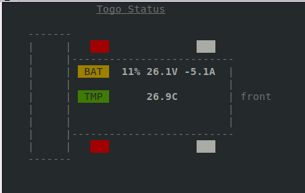

When the battery is faulted or the robot's power supply is not healthy (due to extreme temperatures, overvoltage, etc.), the battery indicator will be red:

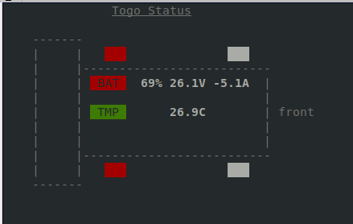

## Battery Temperature

Battery temperature states are color coded so nominal is green and extreme high or low temperatures are red.
Extreme temperatures will be marked with `HOT` or `COLD` in the status monitor to clarify which temperature extreme is occurring.
Note that when the battery is at an extreme temperature, the [Clearpath docs warn](https://docs.clearpathrobotics.com/docs_robots/outdoor_robots/husky/a300/user_manual_husky/#regenerative-current-limits) against operating on steep inclines.

When the temperature is nominal (between 10&deg;C and 45&deg;C), the temperature indicator will be green:

When the temperature is high (above 45&deg;C), the temperature indicator will be red (indicating extreme temperature) and `HOT` will be displayed:

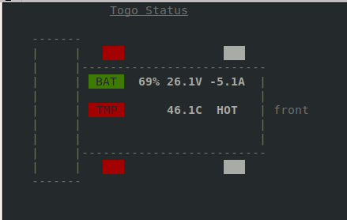

When the temperature is low (below 10&deg;C), the temperature indicator will be red (indicating extreme temperature) and `COLD` will be displayed:

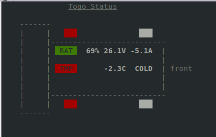

## Plugged In and Charging

When the robot is plugged in and the back hatch is open, the robot will be automatically e-stopped.
We differentiate between plugged in (the presence of the charger) and charging (drawing current to charge the battery).
The charging state will also be indicated by the reported battery current: the reported amperage will be positive when charging and negative when not charging (discharging).

When the robot is plugged in and charging, both the plugged in and charging indicators will show (as well as positive current):

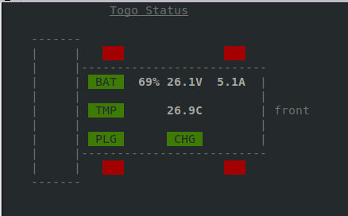

When the robot is plugged in but done charging, only the plugged in indicator will show (0 current draw):

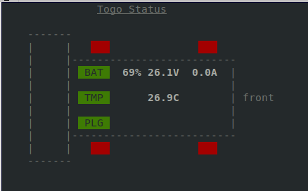

When the robot is not plugged in (and therefore not charging), neither indicator will show (with negative current):

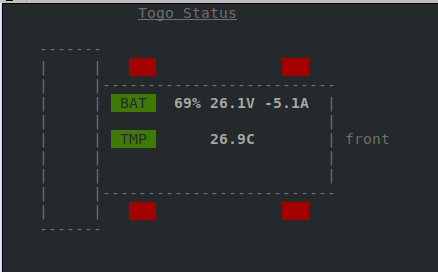

## Driving State

When commands are being sent to the robot, two small arrows will be drawn in the monitor.

When the robot is receiving an all-zero command, the driving arrows will be solid yellow:

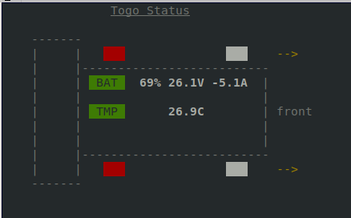

When the robot is receiving a non-zero command, the driving arrows will blink green:

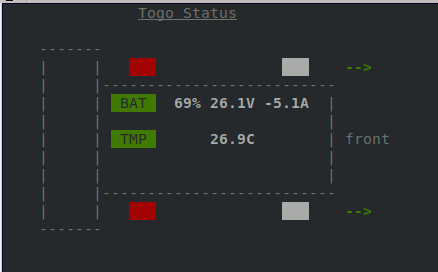
